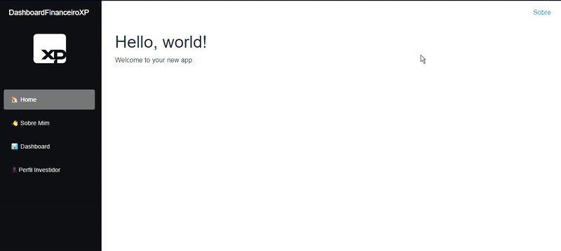

# 📊 Dashboard Financeiro XP  
> Um projeto desenvolvido para demonstrar habilidades com **C#**, **.NET**, **Blazor**, **APIs Financeiras** e **LocalStorage**, simulando um **dashboard financeiro** com dados do mercado.

---

## 📌 Descrição do Projeto  
O **Dashboard Financeiro XP** é um painel interativo que permite acompanhar ações do mercado financeiro e descobrir o **perfil de investidor** do usuário através de um questionário interativo.

O projeto foi desenvolvido com as seguintes funcionalidades:

✅ **Dashboard com Ações** – Mostra as cotações de grandes empresas brasileiras em tempo real.  
✅ **Sistema de Favoritos** – Permite marcar ações favoritas e salvá-las no navegador usando LocalStorage.  
✅ **Perfil de Investidor** – Teste interativo que identifica se o usuário tem um perfil **conservador**, **moderado** ou **agressivo**.  
✅ **Consumo de APIs Financeiras** – Utiliza **Brapi** para puxar cotações de ações em tempo real.  

---

## 💻 Tecnologias Utilizadas  
O projeto foi construído com as seguintes tecnologias:

- **C# & .NET 9.0** – Backend e lógica de negócios.  
- **Blazor** – Interface interativa e reativa.  
- **Blazored.LocalStorage** – Para salvar favoritos do usuário.  
- **APIs Financeiras**:
  - **[Brapi](https://brapi.dev/)** – API usada para buscar cotações do mercado.  
- **CSS customizado** – Layout moderno e responsivo.  

---

## 📂 Estrutura das Páginas  

### 📌 Sobre Mim  
> Página que apresenta algumas informações sobre mim :) 

### 📌 Dashboard  
> Painel principal onde são exibidas cotações de **XP Investimentos, Itaú, Petrobras, Vale, Eletrobras** e outras ações do mercado financeiro.  
> Possui um **sistema de favoritos** que armazena as preferências do usuário via **LocalStorage**.

### 📌 Perfil de Investidor  
> Teste com **10 perguntas** para determinar se o usuário tem um perfil **Conservador, Moderado ou Agressivo**.  
> A lógica de classificação soma pontos de acordo com as respostas e categoriza o investidor.

---

