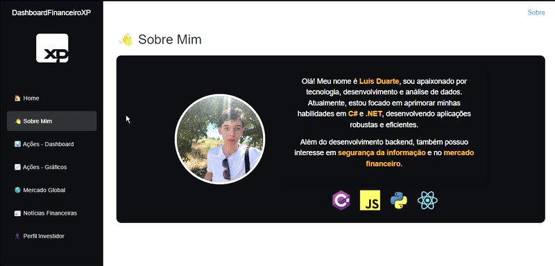

# 📊 Dashboard Financeiro 
>Dashboard financeiro interativo desenvolvido em C# e Blazor, que exibe cotações em tempo real das principais ações da bolsa brasileira, criptomoedas, moedas globais e notícias financeiras. O projeto permite favoritar ativos para fácil acesso e inclui um teste para determinar o perfil de investidor do usuário, armazenando preferências no LocalStorage. Os dados são obtidos via APIs financeiras para garantir informações atualizadas.

>Linguagens/Habilidades trabalhadas: C#, .NET, Blazor, APIs Financeiras, LocalStorage e Gráficos Interativos.

---

## 📌 Descrição do Projeto  
O **Dashboard Financeiro XP** é um painel interativo que permite acompanhar ações do mercado financeiro, criptomoedas, moedas globais e notícias financeiras. Além disso, o usuário pode descobrir seu perfil de investidor através de um questionário interativo.

O projeto foi desenvolvido com as seguintes funcionalidades:

✅ **Consumo de APIs Financeiras** – Utiliza **Brapi** (Para o Dashboard) e **ExchangeRate-API** (Para o Mercado Global) para puxar cotações de ações em tempo real.  
✅ **Dashboard com Ações** – Mostra as cotações de grandes empresas brasileiras em tempo real.  
✅ **Sistema de Favoritos** – Permite marcar ações favoritas e salvá-las no navegador usando LocalStorage.  
✅ **Gráficos Interativos** – Visualização de dados financeiros com gráficos dinâmicos.

✅ **Mercado Global** – Exibe cotações de criptomoedas (Bitcoin) e moedas globais (Dólar, Euro).

✅ **Área de Notícias Financeiras** – Exibe as últimas notícias do mercado financeiro.

✅ **Perfil de Investidor** – Teste interativo que identifica se o usuário tem um perfil **conservador**, **moderado** ou **agressivo**.  

---

## 💻 Tecnologias Utilizadas  
O projeto foi construído com as seguintes tecnologias:

- **C# & .NET 9.0** – Backend e lógica de negócios.  
- **Blazor** – Interface interativa e reativa.  
- **Blazored.LocalStorage** – Para salvar favoritos do usuário.  
- **APIs Financeiras**:
  - **[Brapi](https://brapi.dev/)** – API usada para buscar cotações do mercado.
  - **[ExchangeRate-API](https://www.exchangerate-api.com)** - API para cotações de moedas globais.
- **Gráficos Interativos** – Utilizando a biblioteca Chart.js.
- **CSS customizado** – Layout moderno e responsivo.  

---

## 📂 Estrutura das Páginas  

### 📌 Sobre Mim  
> Página que apresenta algumas informações sobre mim :) 

### 📌 Dashboard  
> Painel principal onde são exibidas cotações de XP Investimentos, Itaú, Petrobras, Vale, Eletrobras e outras ações do mercado financeiro.  
> Possui um sistema de favoritos que armazena as preferências do usuário via **LocalStorage**.

### 📌 Mercado Global
> Página que exibe cotações em tempo real de Bitcoin (BTC), Dólar (USD), Euro (EUR) e outros ativos globais.
> Permite favoritar ativos e salvar preferências no LocalStorage.

### 📌 Gráficos
> Visualização interativa de dados financeiros, como histórico de cotações e desempenho de ativos.

### 📌 Notícias Financeiras
> Área dedicada às últimas notícias do mercado financeiro, obtidas de fontes confiáveis.
> Mantém o usuário atualizado sobre tendências e eventos importantes.

### 📌 Perfil de Investidor  
> Teste com **10 perguntas** para determinar se o usuário tem um perfil **Conservador, Moderado ou Agressivo**.  
> A lógica de classificação soma pontos de acordo com as respostas e categoriza o investidor.

---

